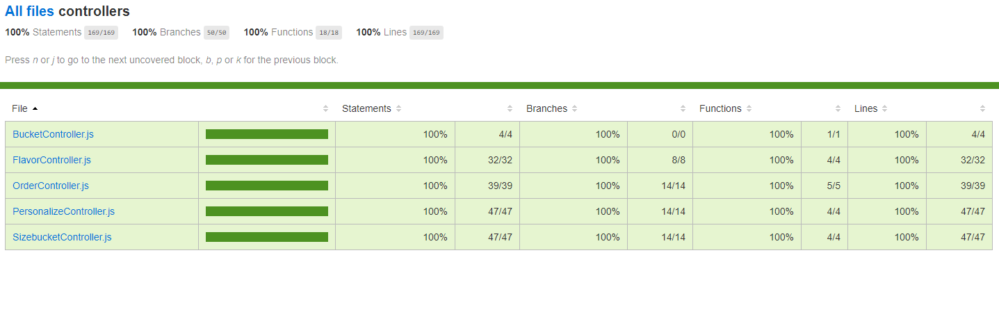
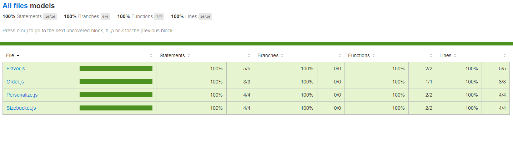
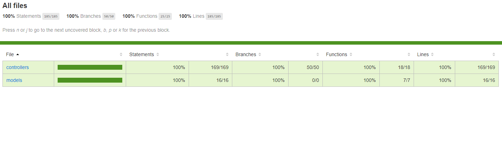
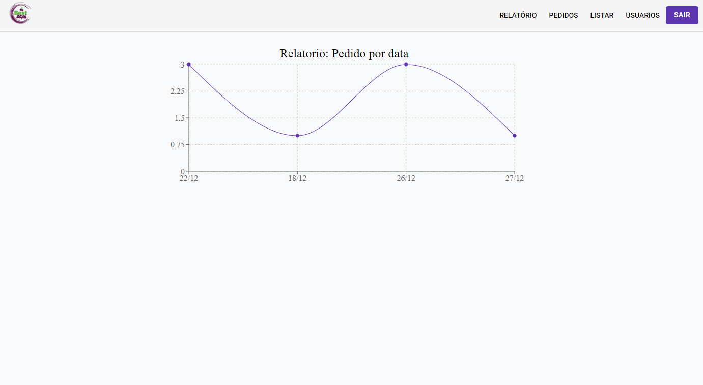
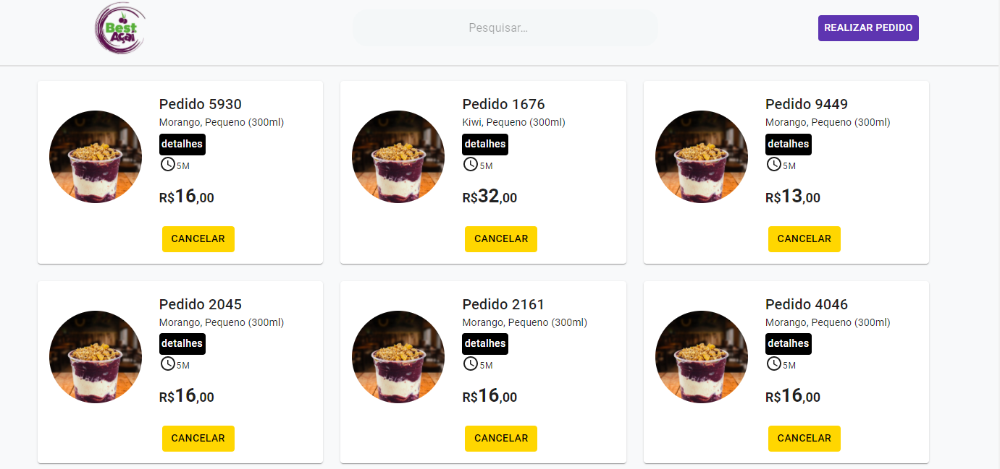
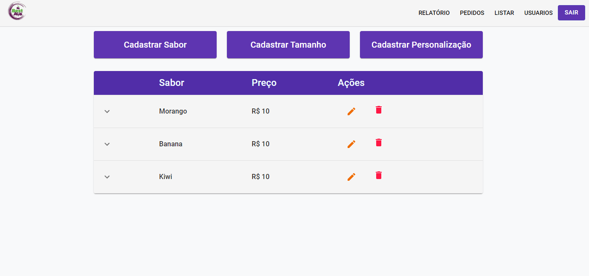
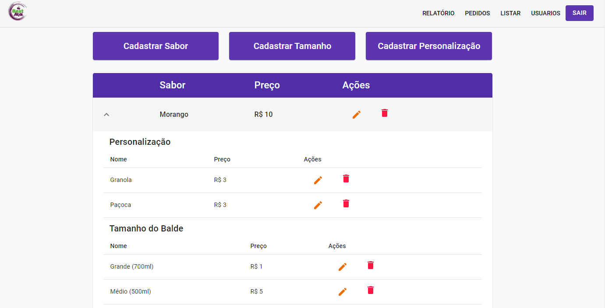
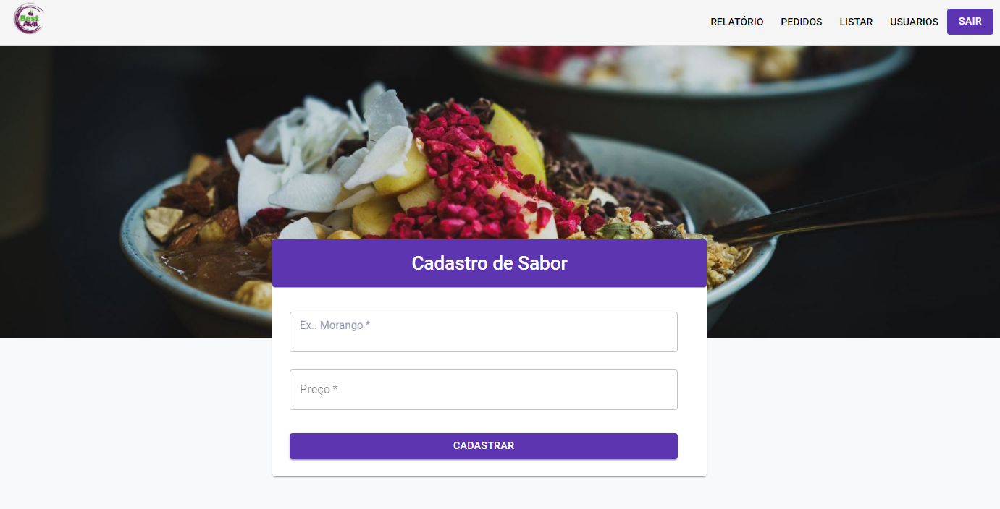
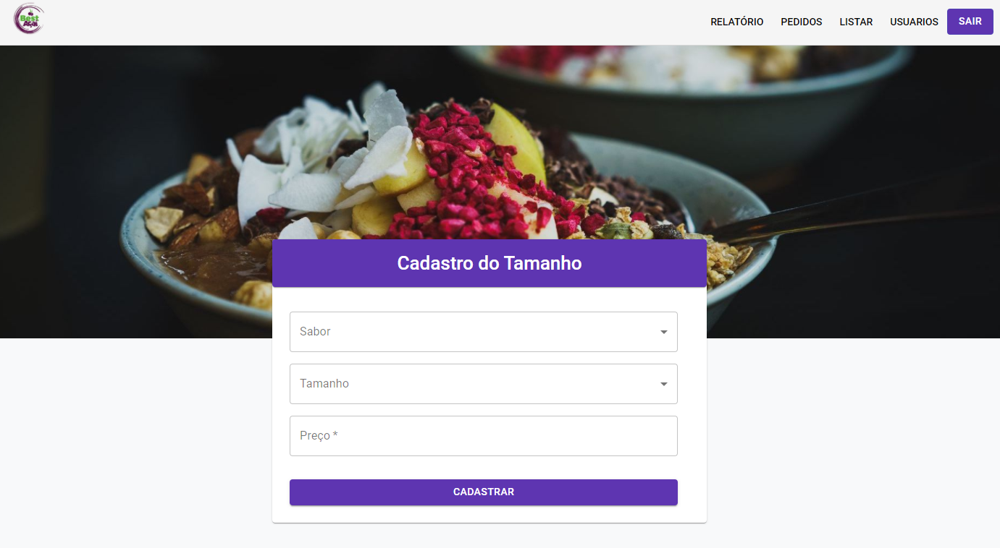
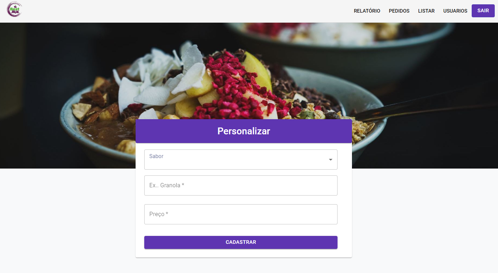

## PROJETO - MINI PEDIDO DE AÇAÍ DELIVERY (Nodejs e React js)

### Demonstração de um Pedido

<h1 align="center">
    
</h1>

Este projeto tem como objetivo principal estudar Nodejs e Reactjs e suas tecnologias como Jest e Supertest no
desenvolvimento de um sistema.

## Tecnologias Usadas:

 Nodejs :

- express,
- sequelize,
- postgres,
- supertest,
- jest,
- factory-girl,
- faker,
- cross-env,
- dotenv.

 Reactjs :

- redux-saga,
- redux,
- material-ui,
- immer,
- history,
- axios,
- animate.css,
- hooks,
- recharts.

---

## Como baixar o projeto

```bash
#Clona repositório
$ git clone https://github.com/edpedro/acaibest.git

#Entra no diretório
$ cd server e web 

#Entra nas pastas Backend/Frontend e instalar dependência 
$ yarn 

#Inicia o projeto
$ yarn start

```

---

## Env server

```bash
#Precisa colocar as chaves
$ APP_SECRET=

DB_HOST=
DB_USER=
DB_PASS=
DB_NAME=


.ENV.TEST
APP_SECRET=

DB_HOST=
DB_USER=
DB_PASS=
DB_NAME= 


```

---

### Testes 100%

<h1 align="center">
    
</h1>
<h1 align="center">
    
</h1>
<h1 align="center">
    
</h1>


### Grafico

<h1 align="center">
    
</h1>


### Images do site

<h1 align="center">
    
</h1>
<h1 align="center">
    
</h1>

<h1 align="center">
    
</h1>

<h1 align="center">
    
</h1>

<h1 align="center">
    
</h1>

<h1 align="center">
    
</h1>


Desenvolvido por Eduardo Pedro, Edp2013.ep@gmail.com